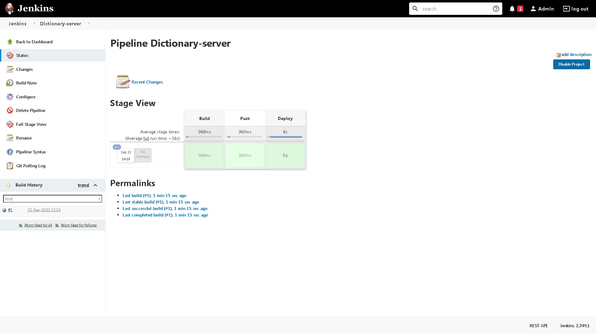

# Kubernetes CI/CD pipeline example with Jenkins

This repo takes from where we left in the [k8s-distributed-example](https://github.com/luigidifraia/k8s-distributed-example) repo and assumes a similar base setup, i.e. using MicroK8s 1.18 with `ingress`, `dns` and `repository` components enabled.

# TL;DR

Build the Docker image for Jenkins:

```bash
cd docker-build
docker build -t localhost:32000/jenkins .
docker push localhost:32000/jenkins
```

Deploy Jenkins:

```bash
cd ../k8s-deploy
kubectl create ns jenkins
kubectl apply -f jenkins-deployment.yaml
kubectl apply -f jenkins-service.yaml
kubectl apply -f jenkins-ingress.yaml
```

Patch the host used in the ingress for Jenkins, using [xip.io](http://xip.io/) to resolve custom domain names used for testing:

```bash
HOST=$(ip -o route get to 8.8.8.8 | sed -n 's/.*src \([0-9.]\+\).*/\1/p').xip.io

kubectl patch ingress jenkins -n jenkins --type='json' -p="[{\"op\": \"replace\", \"path\": \"/spec/rules/0/host\", \"value\":\"${HOST}\"}]"
```

If you were to use the [NGINX Ingress](https://kubernetes.github.io/ingress-nginx/) instead of the `ingress` addon, you'd have to change the first command with:

```bash
HOST=$(kubectl get svc ingress-nginx-controller -n ingress-nginx -o jsonpath='{.status.loadBalancer.ingress[0].ip}').xip.io
```

Retrieve the password to unlock Jenkins with:

```bash
kubectl -n jenkins exec $(kubectl get pod -n jenkins -l app=jenkins --no-headers -o=custom-columns='DATA:.metadata.name') -- cat /var/jenkins_home/secrets/initialAdminPassword
```

Get the configuration required to create the `kubeconfig` credentials used by the `kubernetes-cd` plugin in Jenkins:

```bash
microk8s config
```

The actual config file is stored here: */var/snap/microk8s/current/credentials/client.config*

# Testing CI/CD

The one below is an example of the build process for the project as per [k8s-distributed-example](https://github.com/luigidifraia/k8s-distributed-example) repo.



From the output:

```
Started by user Admin
Obtained jenkins/Jenkinsfile from git https://github.com/luigidifraia/k8s-distributed-example.git
Running in Durability level: MAX_SURVIVABILITY
[Pipeline] Start of Pipeline
[Pipeline] node
Running on Jenkins in /var/jenkins_home/workspace/Dictionary-server
[Pipeline] {
[Pipeline] checkout
Selected Git installation does not exist. Using Default
The recommended git tool is: NONE
No credentials specified
Cloning the remote Git repository
Cloning repository https://github.com/luigidifraia/k8s-distributed-example.git
 > git init /var/jenkins_home/workspace/Dictionary-server # timeout=10
Fetching upstream changes from https://github.com/luigidifraia/k8s-distributed-example.git
 > git --version # timeout=10
 > git --version # 'git version 2.11.0'
 > git fetch --tags --progress -- https://github.com/luigidifraia/k8s-distributed-example.git +refs/heads/*:refs/remotes/origin/* # timeout=10
 > git config remote.origin.url https://github.com/luigidifraia/k8s-distributed-example.git # timeout=10
 > git config --add remote.origin.fetch +refs/heads/*:refs/remotes/origin/* # timeout=10
Avoid second fetch
 > git rev-parse refs/remotes/origin/master^{commit} # timeout=10
Checking out Revision 8459951d5b1e5a96b9f7707a3a55126782f0c22b (refs/remotes/origin/master)
 > git config core.sparsecheckout # timeout=10
 > git checkout -f 8459951d5b1e5a96b9f7707a3a55126782f0c22b # timeout=10
Commit message: "Rename deployment material"
First time build. Skipping changelog.
[Pipeline] sh
+ git rev-parse --short HEAD
[Pipeline] readFile
[Pipeline] stage
Using the ‘stage’ step without a block argument is deprecated
Entering stage Build
Proceeding
[Pipeline] sh
+ docker build -t localhost:32000/dictionary-server:8459951 docker-build
Sending build context to Docker daemon  6.144kB

Step 1/3 : FROM node:7.5-slim
 ---> b3a08de64d50
Step 2/3 : COPY server.js /server.js
 ---> Using cache
 ---> 0baa089c20f4
Step 3/3 : CMD node /server.js
 ---> Using cache
 ---> de1e8ac379fc
Successfully built de1e8ac379fc
Successfully tagged localhost:32000/dictionary-server:8459951
[Pipeline] stage
Using the ‘stage’ step without a block argument is deprecated
Entering stage Push
Proceeding
[Pipeline] sh
+ docker push localhost:32000/dictionary-server:8459951
The push refers to repository [localhost:32000/dictionary-server]
214e362b3109: Preparing
21832327627d: Preparing
04a7be02aa52: Preparing
5bb0f641e845: Preparing
0eb22bfb707d: Preparing
a2ae92ffcd29: Preparing
a2ae92ffcd29: Waiting
0eb22bfb707d: Layer already exists
04a7be02aa52: Layer already exists
21832327627d: Layer already exists
5bb0f641e845: Layer already exists
214e362b3109: Layer already exists
a2ae92ffcd29: Layer already exists
8459951: digest: sha256:a755db94025ac816a1bd175cf10a1490aa1b94fc4ff0eec55bf5e2d05d3a58f1 size: 1577
[Pipeline] stage
Using the ‘stage’ step without a block argument is deprecated
Entering stage Deploy
Proceeding
[Pipeline] kubernetesDeploy
Starting Kubernetes deployment
Loading configuration: /var/jenkins_home/workspace/Dictionary-server/k8s-deploy/dictionary-deployment.yaml
Applied V1Deployment: class V1Deployment {
    apiVersion: apps/v1
    kind: Deployment

... output omitted ...

}
Loading configuration: /var/jenkins_home/workspace/Dictionary-server/k8s-deploy/varnish-deployment.yaml
Applied V1Deployment: class V1Deployment {
    apiVersion: apps/v1
    kind: Deployment

... output omitted ...

}
Loading configuration: /var/jenkins_home/workspace/Dictionary-server/k8s-deploy/varnish-ingress.yaml
Applied NetworkingV1beta1Ingress: class NetworkingV1beta1Ingress {
    apiVersion: networking.k8s.io/v1beta1
    kind: Ingress

... output omitted ...

}
Loading configuration: /var/jenkins_home/workspace/Dictionary-server/k8s-deploy/varnish-service.yaml
Applied V1Service: class V1Service {
    apiVersion: v1
    kind: Service

... output omitted ...

}
Finished Kubernetes deployment
[Pipeline] }
[Pipeline] // node
[Pipeline] End of Pipeline
Finished: SUCCESS
``

# Known issues

At the moment the continuous deployment pipeline is failing as per [this issue report](https://github.com/jenkinsci/kubernetes-cd-plugin/issues/134).  In order to address the issue you might want to downgrade the Jackson 2 API plugin to version 2.10.3, available from the archives [here](https://updates.jenkins.io/download/plugins/jackson2-api/).

